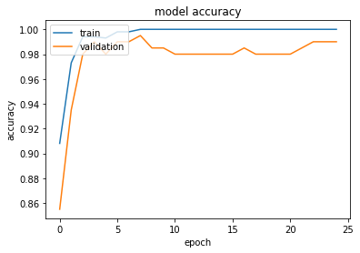

# Multi-Cancer Identification and Segmentation

## Data Preprocessing

- Normalized the images by dividing them by 255-
-  Further squashed the images to be between 0,1
- Converted 1 channel images in segmentation to be 3 channeled
- Resized all images to be of resolution 224x224

## Data Enhancement

- Used data augmentation techniques to: -
    - Balance the classes of all problems, due to the existing class imbalance in multiple classes in the dataset
    - Increase the data size so the model could generalize more to new input
    - Introduced the models to seemingly new inputs, so it doesn’t overfit the training data, and score a better accuracy in new unseen data
- Implemented a class weighting technique to further boost the performance of classification models

## Classification Models

### Model 1: VGG16

- A classical CNN where several convolutions layers are placed, and every two to three convolutions are followed by a pooling layer to reduce the spatial dimensions of the image, while increasing the depth of the feature maps.

- Followed by a vanilla MLP network to classify the given feature maps of the image.

### Model 2: MobileNet

- Introduced a new concept: Depth Wise Convolution, where it convolves every single channel from the previous layer separately, and controlling the filter size of the layer with a 1x1 convolution bottleneck
- Very efficient computational wise, while being extremely deep.
  

## Segmentation Model

### Model: U-Net

- Encoder:
  - Encode the input image to a low dimensional space -latent space- with a large depth, to maintain the visual and semantic features of the given image.
- Decoder:
  - Decode the latent space produced by the decoder trying to predict where the object to be segmented is located.
- Skip Connections:
  - Preserves the spatial information of the encoded image to be reflected in the decoding process.

## Training and testing times

|                Problem                 | Epochs | Time  |
| :------------------------------------: | :----: | :---: |
|            Brain Vs Breast             |   2    |  38s  |
|           Tumor Vs No Tumor            |   10   |  81s  |
| Normal Vs Malignant Vs Benign (Breast) |   25   | 700s  |
|           Brain Segmentation           |   15   | 330s  |
|          Breast Segmentation           |   25   | 875s  |

## Results
### Classification

#### Brain Vs Breast

| Train Accuracy | Test Accuracy |
| :------------: | :-----------: |
|    100.00%     |    100.00%    |

| Train Loss | Test Loss |
| :--------: | :-------: |
|    ≈ 0     |    ≈ 0    |

#### Tumor Vs No Tumor (Brain)

| Train Accuracy | Test Accuracy |
| :------------: | :-----------: |
|    100.00%     |    99.50%     |

| Train Loss | Test Loss |
| :--------: | :-------: |
| 1.5271e-04 |  0.0292   |

#### Normal Vs Malignant Vs Benign

| Train Accuracy | Test Accuracy |
| :------------: | :-----------: |
|    100.00%     |    86.80%     |

| Train Loss | Test Loss |
| :--------: | :-------: |
|   0.009    |   0.616   |

| Class     | Precision | Recall | F1-Score | Support |
| --------- | --------- | ------ | -------- | ------- |
| Normal    | 0.88      | 0.97   | 0.92     | 30      |
| Malignant | 0.79      | 0.90   | 0.84     | 30      |
| Benign    | 0.94      | 0.77   | 0.85     | 39      |

| Class        | Precision | Recall | F1-Score | Support |
| ------------ | --------- | ------ | -------- | ------- |
| Accuracy     | N/A       | N/A    | 0.87     | 99      |
| Macro Avg    | 0.87      | 0.88   | 0.87     | 99      |
| Weighted Avg | 0.88      | 0.87   | 0.87     | 99      |

### Segmentation

#### Brain Tumor Segmentation

|      Metric      | Train  |  Test  |
| :--------------: | :----: | :----: |
|     Accuracy     | 99.5%  | 98.12% |
|       Loss       | 0.018  | 0.0902 |
|     MeanIoU      | 0.5241 | 0.5879 |
| Dice Coefficient | 0.9244 | 0.8164 |

|              Predicate Mask               |                Actual Mask                |                Brain Scan                 |
| :---------------------------------------: | :---------------------------------------: | :---------------------------------------: |
|  |  |  |
|  |  |  |

#### Breast Tumor Segmentation

|      Metric      | Train  |  Test  |
| :--------------: | :----: | :----: |
|     Accuracy     | 97.55% | 89.37% |
|       Loss       | 0.0683 | 0.4284 |
|     MeanIoU      | 0.4585 | 0.4436 |
| Dice Coefficient | 0.7658 | 0.6159 |

|               Predicate Mask               |                Actual Mask                 |                Breast Scan                 |
| :----------------------------------------: | :----------------------------------------: | :----------------------------------------: |
|  |  |  |
|  |  |  |
